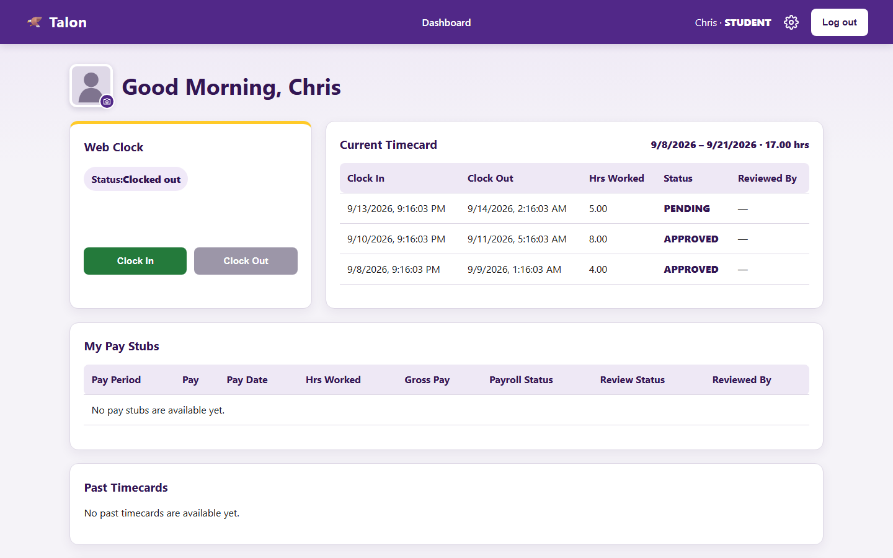
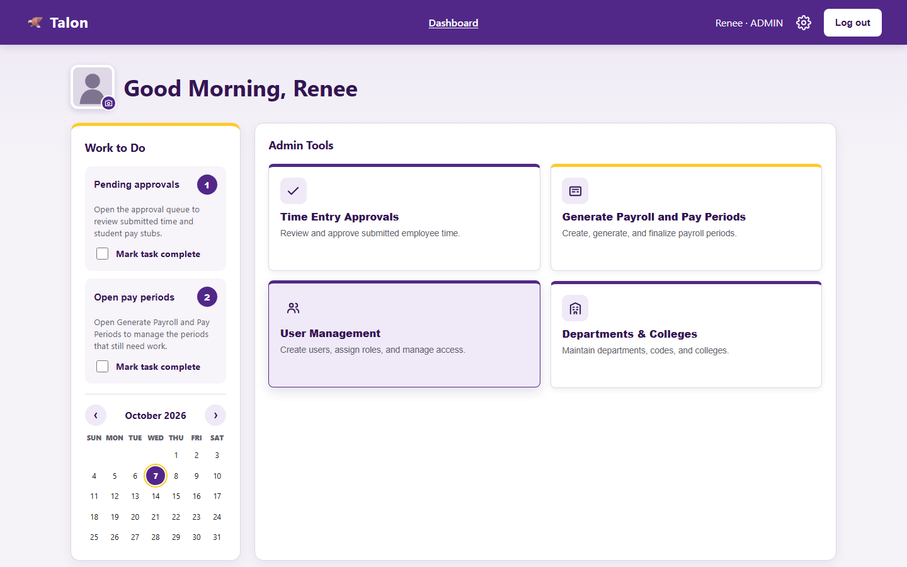

# Talon

A redesign of Tennessee Tech's payroll and web-clock system, replacing the Oracle-based application
with a modern, secure web app running entirely on **Cloudflare** — a Workers API, a D1 database, and
a React frontend published as Worker static assets. No servers, no VMs, no open database ports.

**Live:** [talontime.org](https://talontime.org) · Every push to `main` is typechecked, run through
Playwright end-to-end and accessibility tests in GitHub Actions, and deployed only if they pass.

| Student web clock | Admin tools |
|---|---|
|  |  |

More: [login](docs/screenshots/login.png) · [supervisor dashboard](docs/screenshots/supervisor-dashboard.png)
(all screenshots use the local demo seed data).

## My role

Talon is a Tennessee Tech capstone project. We designed and built it end to end: the Workers API and
D1 schema, auth and role-based access control, the payroll engine, the React frontend, the
Playwright test suite, and the CI/CD pipeline that deploys to talontime.org.

## Docs

- [docs/ARCHITECTURE.md](docs/ARCHITECTURE.md) — stack, layout, request flow, role/feature matrix
- [docs/DATABASE.md](docs/DATABASE.md) — ER diagram, schema decisions, migrations
- [docs/SECURITY.md](docs/SECURITY.md) — threat model, auth design, verified RBAC tests
- [docs/DEPLOYMENT.md](docs/DEPLOYMENT.md) — **sharing D1 with your team**, deploying, plan limits
- [docs/SHARED-ACCOUNT-SETUP.md](docs/SHARED-ACCOUNT-SETUP.md) — step-by-step move to the shared Cloudflare account, email routing, Resend
- [docs/EMAIL.md](docs/EMAIL.md) — Resend setup, password reset, notification emails
- [docs/PRIVACY-ACCESSIBILITY.md](docs/PRIVACY-ACCESSIBILITY.md) — production privacy and accessibility release checklist
- [docs/GANTT.md](docs/GANTT.md) — project timeline

## Features

- JWT auth with rotating refresh tokens; role hierarchy student < supervisor < admin
- Web clock with a supervisor approval queue and an auditable correction workflow
- Payroll engine: biweekly hourly pay with per-week FLSA overtime, monthly salary for faculty/staff
- Auto-generated CSV payroll reports scoped by department or college, with supervisors pinned
  server-side to their own department
- Admin user management and pay-period lifecycle (create → generate stubs → finalize)
- Admin department/college management — all 104 registrar codes seeded but fully editable
- Audit logging of every significant action, with the true client IP
- Accessible UI: labeled controls, visible focus, `aria-live` status regions, skip link, reduced-motion support, and a public accessibility statement
- Public privacy notice describing the data Talon processes, its security controls, and production-review requirements

## Quick start — full stack, locally

`wrangler dev` runs a real Worker against a **local** D1 database. Nothing touches the shared
remote database, and there is no CPU limit locally.

```bash
npm install
npx wrangler login

# One person creates the database and commits the id into server/wrangler.toml
npx wrangler d1 create talon-db

cp server/.dev.vars.example server/.dev.vars   # then set local JWT secrets

npm run db:migrate:local     # create the schema
npm run db:seed:generate     # build seed.sql (real password hashes)
npm run db:seed:local        # load demo data

npm run dev                  # app and API on http://localhost:8787
```

Demo accounts (change before using real data):

| Role | Email | Password |
|---|---|---|
| Admin | admin@tntech.edu | `password123` |
| Supervisor | supervisor@tntech.edu | `password123` |
| Student | student@tntech.edu | `password123` |

Passwords are stored as salted scrypt hashes. Talon accepts only normalized addresses ending in
`@tntech.edu`; this restriction is enforced by both the API and D1 triggers.

## Working as a team

Add your teammates to the **Cloudflare account** (Manage Account → Members → Invite → *Cloudflare
Workers Admin*), then everyone develops against their **own local D1**. The schema is shared through
the committed `server/migrations/` folder, not by everyone pointing at the remote database.

Full instructions: [docs/DEPLOYMENT.md](docs/DEPLOYMENT.md#sharing-the-database-with-your-team).

## Deploying

```bash
npm run deploy    # builds and deploys the API plus React frontend
```

One caveat worth knowing before you deploy: the **Workers Free plan allows 10ms of CPU per request**,
and a secure password hash costs more than that. This password-login deployment needs Workers Paid
(minimum $5/month). Details are in
[docs/DEPLOYMENT.md](docs/DEPLOYMENT.md#password-login-requires-workers-paid).
