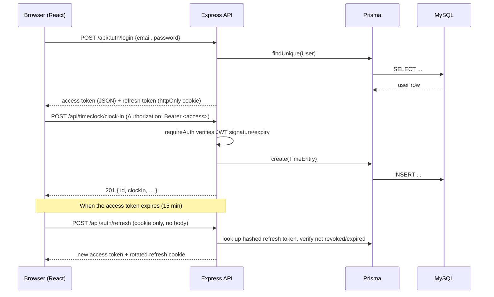

# Architecture Overview

## Stack

| Layer | Choice | Why |
|---|---|---|
| Frontend | React 18 + TypeScript + Vite | Fast local dev, small footprint, easy to statically host on Cloudflare Pages later |
| Backend | Node.js + Express + TypeScript | Simple, well-understood REST API; matches the frontend's language |
| ORM / migrations | Prisma | Type-safe queries generated from `schema.prisma`, built-in migration tooling |
| Database | MySQL 8 (local: Docker Compose; hosted: GCP Cloud SQL) | Relational integrity fits the domain — see [DATABASE.md](DATABASE.md) |
| Auth | JWT (short-lived access + rotating refresh) | Stateless API auth without a session store; see [SECURITY.md](SECURITY.md) |
| Hosting target | GCP VM + Cloudflare Tunnel/domain | Free-tier friendly, matches project brief; see [DEPLOYMENT.md](DEPLOYMENT.md) |

## Repository layout

```
Talon/
├─ server/                  Express API
│  ├─ prisma/schema.prisma  Database schema (source of truth)
│  ├─ prisma/seed.ts        Sample college/department/users for local dev
│  └─ src/
│     ├─ config/            env validation, Prisma client singleton
│     ├─ middleware/        auth, RBAC, security headers, error handling
│     ├─ routes/            one file per resource (auth, users, timeclock, payroll, reports, org)
│     ├─ services/          business logic (payroll calculation, CSV reports, audit log)
│     └─ utils/             JWT signing/verification, CIDR matching, async wrapper
├─ client/                  React SPA
│  └─ src/
│     ├─ api/client.ts      fetch wrapper: attaches JWT, auto-refreshes on 401
│     ├─ context/AuthContext.tsx
│     ├─ components/        ClockWidget, ApprovalQueue, ReportGenerator, etc.
│     └─ pages/             LoginPage, DashboardPage (role-adaptive), NotFoundPage
├─ docs/                    this folder
└─ docker-compose.yml       local MySQL for development
```

## Request flow



## Role → feature matrix

| Feature | Student | Supervisor | Admin |
|---|:---:|:---:|:---:|
| Clock in/out, view own timesheet | ✅ | ✅ | ✅ |
| View own pay stubs | ✅ | ✅ | ✅ |
| Approve/reject direct reports' time entries | — | ✅ (own reports only) | ✅ (all) |
| Correct a time entry | — | ✅ (own reports only) | ✅ (all) |
| Generate department payroll report | — | ✅ (own department only, server-enforced) | ✅ (any scope) |
| Create/deactivate users | — | — | ✅ |
| Create/generate/finalize pay periods | — | — | ✅ |
| Manage department/college codes | — | — | ✅ |

Pay **cycle** (biweekly vs. monthly) is independent of this table — it's a property of `User.payType`,
not of role. Students are seeded as biweekly/hourly and faculty/staff as monthly/salaried per the
project brief, but the schema doesn't hard-code that assumption (see [DATABASE.md](DATABASE.md#key-design-decisions)).

## What's stubbed vs. real

This is a **local-runnable scaffold**, per the project scope: everything above runs against a local
MySQL instance today. Hosting (GCP/Cloudflare), a real identity provider (TN Tech SSO), and CI/CD are
documented as a plan in [DEPLOYMENT.md](DEPLOYMENT.md) but not yet wired up — connect those when ready.
