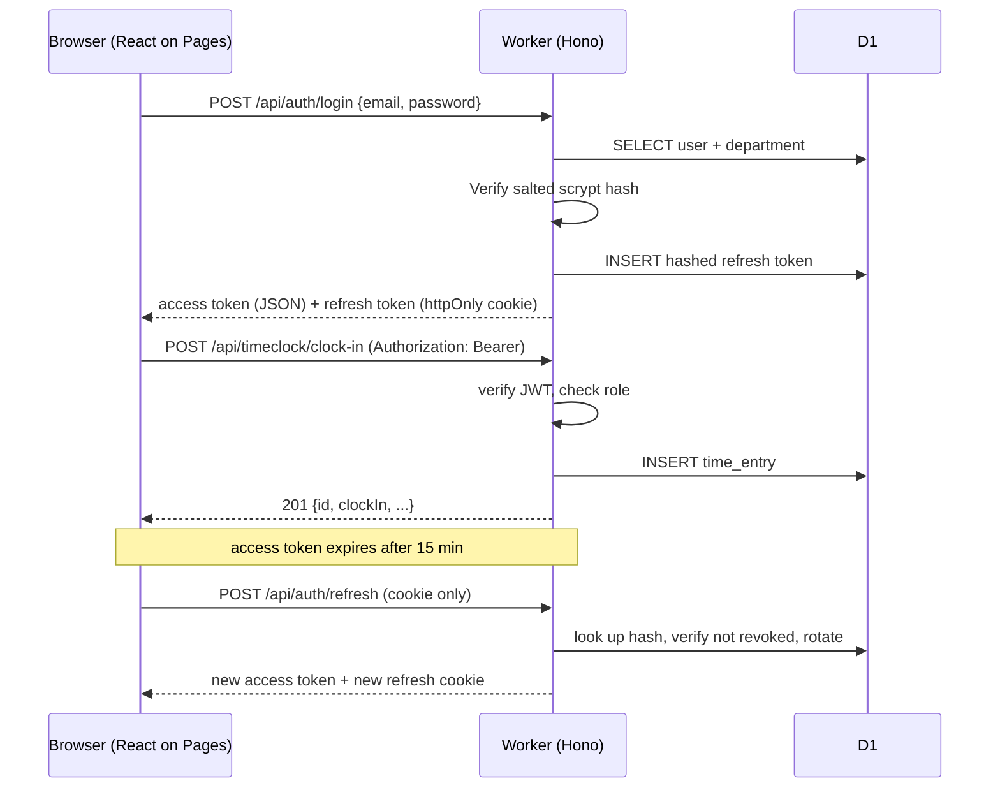

# Architecture Overview

## Stack

| Layer | Choice | Why |
|---|---|---|
| Frontend | React 18 + TypeScript + Vite | Static build, deployable to Cloudflare Pages for free |
| API | Hono on Cloudflare Workers | Workers-native framework; Express does not run on the Workers runtime |
| Database | Cloudflare D1 (SQLite) | Serverless, no host to manage, no network port to expose |
| ORM / migrations | Drizzle | First-class D1 support, ~8KB bundle (Prisma is 1MB+ and its edge support is still preview) |
| Auth | JWT via `jose` + scrypt via `node:crypto` | Both run natively on the current Workers runtime |
| Validation | Zod | Runs anywhere, shared shape between parse and TypeScript types |
| Hosting | Cloudflare Pages + Workers + D1 | One provider, free tier covers everything except a deployed password login |

Everything in this stack was chosen because it runs on the Workers runtime. That constraint drove
several substitutions away from the more familiar Node equivalents — see
[Migration notes](#migration-notes-from-the-node--mysql-design).

## Repository layout

```
Talon/
├─ server/                    Cloudflare Worker (the API)
│  ├─ wrangler.toml           Worker config + D1 binding
│  ├─ drizzle.config.ts       Migration generation
│  ├─ migrations/             Generated SQL - committed, shared via git
│  ├─ seed/                   Department code list + seed.sql generator
│  └─ src/
│     ├─ index.ts             Hono app, routing, error handling
│     ├─ db/schema.ts         Database schema (source of truth)
│     ├─ lib/                 password (scrypt), jwt (jose), money (cents)
│     ├─ middleware/auth.ts   JWT verification + RBAC
│     ├─ routes/              auth, users, org, timeclock, payroll, reports
│     └─ services/            payroll calculation, CSV reports, audit log
├─ client/                    React SPA -> Cloudflare Pages
│  └─ src/
│     ├─ api/                 fetch wrapper, mock backend for demos
│     ├─ context/             AuthContext
│     ├─ components/          ClockWidget, ApprovalQueue, ReportGenerator, ...
│     └─ pages/               Login, Dashboard (role-adaptive), NotFound
└─ docs/                      this folder
```

## Request flow



## Role → feature matrix

| Feature | Student | Supervisor | Admin |
|---|:---:|:---:|:---:|
| Clock in/out, view own timesheet | ✅ | ✅ | ✅ |
| View own pay stubs | ✅ | ✅ | ✅ |
| Approve/reject direct reports' time entries | — | ✅ (own reports only) | ✅ (all) |
| Correct a time entry | — | ✅ (own reports only) | ✅ (all) |
| Generate payroll report | — | ✅ (own department, server-enforced) | ✅ (any scope) |
| Create/deactivate users | — | — | ✅ |
| Create/generate/finalize pay periods | — | — | ✅ |
| Manage department/college codes | — | — | ✅ |

Pay **cycle** is independent of role: it is a property of `payType`, so the schema does not assume
every student is hourly.

## Payroll calculation

Biweekly employees are paid from **approved** time entries only. Hours are grouped into Sunday-anchored
weeks and split at the FLSA 40-hour threshold, with overtime at 1.5x — so a 54-hour week yields 40
regular + 14 overtime rather than being averaged across the period. Monthly employees are paid
`annual_salary_cents / 12`. All arithmetic is in integer cents.

## Migration notes (from the Node + MySQL design)

The project originally targeted Express + Prisma + MySQL on a GCP VM. Moving to Cloudflare required
replacing every component that depends on Node-specific APIs:

| Was | Problem on Workers | Now |
|---|---|---|
| Express | Not the Workers runtime | Hono |
| bcrypt | Native C++ addon, cannot load | scrypt via Workers `node:crypto` |
| jsonwebtoken | Requires Node `crypto` | jose |
| helmet / cors / express-rate-limit | Express middleware | Hono `secureHeaders`/`cors` + Cloudflare WAF and Rate Limiting |
| Prisma + MySQL | Heavy bundle, edge support preview | Drizzle + D1 |
| `DECIMAL(10,2)` | SQLite has no true DECIMAL | INTEGER cents |
| Per-employee query loop | D1 free plan allows 50 queries/request | Batched: fixed query count |
| Docker Compose MySQL | — | `wrangler dev` local D1 |
| GCP VM + firewall/port hardening | — | No host exists; controls move to the Cloudflare edge |

## What is verified vs. planned

Verified against a running Worker and D1: login and JWT refresh, RBAC denial and cross-department
scoping, clock in/out through the UI, approval workflow, biweekly and monthly payroll math including
overtime, CSV report generation, and department/college management.

Not yet done: deployment to the Cloudflare edge, SSO integration, an automated test suite, and
responsive/accessibility verification on real devices. See [GANTT.md](GANTT.md).
