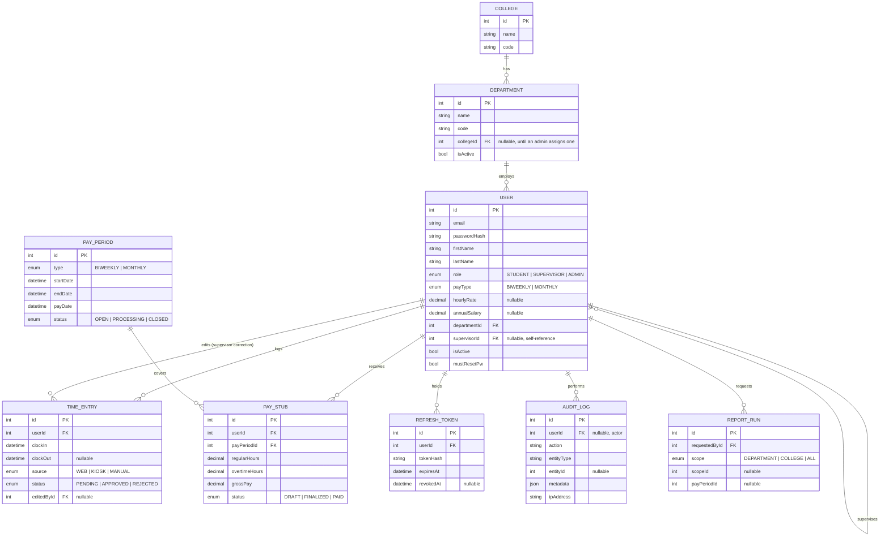

# Database Design

Talon is modeled in [`server/prisma/schema.prisma`](../server/prisma/schema.prisma) and targets
**MySQL 8** (local: Docker Compose; hosted: GCP Cloud SQL for MySQL — see
[DEPLOYMENT.md](DEPLOYMENT.md)). Prisma is the ORM/migration tool, so the schema file is the
single source of truth — never hand-edit the database.

## Entity-relationship diagram



## Key design decisions

- **`Role` (permission level) is separate from `PayType` (pay cycle).** The prompt's "student /
  supervisor / admin" levels are an authorization concept; "biweekly / monthly" is a payroll
  concept. Collapsing them (e.g. assuming every STUDENT is biweekly) would break the moment a
  grad assistant or salaried student-services role shows up. `ADMIN` sits above `SUPERVISOR`
  in the permission hierarchy (see [`auth.ts`](../server/src/middleware/auth.ts)) rather than
  being a disjoint role, matching how the real payroll office works.
- **Department codes are data, not source code.** `Department.code`/`name`/`collegeId`/`isActive`
  are ordinary editable rows, managed from the admin dashboard's Department Management screen
  (`POST`/`PATCH /api/org/departments`) rather than a hardcoded list — see
  [`server/prisma/departmentCodes.ts`](../server/prisma/departmentCodes.ts) for the one-time seed
  list and [`org.routes.ts`](../server/src/routes/org.routes.ts) for the CRUD API. `collegeId` is
  nullable because a freshly seeded or newly added department code often doesn't have a college
  assignment yet; `isActive` lets an admin retire a code from the "new user" dropdown without
  breaking history for employees already on it (deactivate, not delete — same pattern as `User.isActive`).
- **`User.supervisorId` self-relation** drives the approval chain: a supervisor's `/timeclock/pending`
  and `/reports/payroll` queries are scoped to `WHERE supervisorId = <me>` / `WHERE departmentId = <my dept>`
  at the database level, not just hidden in the UI — see [SECURITY.md](SECURITY.md#authorization).
- **Time entries are never overwritten in place by employees.** Clock-out sets `clockOut`, but any
  correction after the fact goes through `PATCH /timeclock/:id/correct`, which is supervisor/admin-only,
  resets `status` back to `PENDING`, and stamps `editedById` — so there's always a record of who
  changed a timesheet and it re-enters the approval queue instead of silently taking effect.
- **Pay stubs are derived, not entered.** `PayStub` rows are generated by
  [`payroll.service.ts`](../server/src/services/payroll.service.ts) from approved `TimeEntry` rows
  (biweekly) or `annualSalary` (monthly) — there's no path to hand-key a gross pay number, which
  removes a whole class of payroll-fraud and fat-finger risk.
- **`ReportRun` is an audit trail, not report storage.** Reports are generated on demand as CSV and
  streamed to the requester; we log *who ran what report, over what scope, when* without persisting
  a second copy of sensitive pay data that then needs its own retention/access policy.
- **Money fields use `Decimal`, never `Float`.** `hourlyRate`, `annualSalary`, `grossPay`, etc. are
  `Decimal(_, 2)` in MySQL to avoid binary floating-point rounding errors in payroll math.
- **Indexes** are placed on every foreign key plus the columns the app actually filters/sorts by
  (`TimeEntry(userId, clockIn)`, `TimeEntry(status)`, `AuditLog(entityType, entityId)`) rather than
  indexing speculatively.

## Migrations

```bash
npm run prisma:migrate --workspace=server   # dev: create + apply a migration
npm run prisma:seed --workspace=server      # load College/Department/sample users
npm run prisma:studio --workspace=server    # browse data in a GUI
```

In production, `prisma migrate deploy` (no interactive prompts) runs from CI/CD against Cloud SQL —
see [DEPLOYMENT.md](DEPLOYMENT.md).
