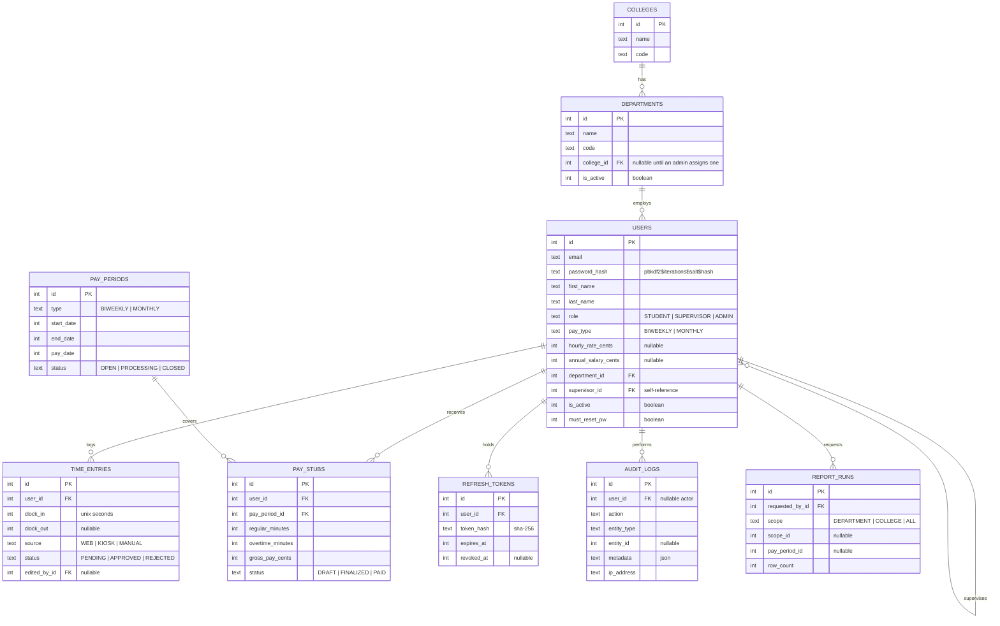

# Database Design

Talon's schema is defined in [`server/src/db/schema.ts`](../server/src/db/schema.ts) using **Drizzle
ORM**, and targets **Cloudflare D1** (SQLite). The schema file is the single source of truth;
migrations are generated from it and committed to git. Never hand-edit the database.

## Entity-relationship diagram



## Key design decisions

- **Money is INTEGER cents; worked time is INTEGER minutes.** This is the most important difference
  from the earlier MySQL design, which used `DECIMAL(10,2)`. **SQLite has no true DECIMAL type** —
  a "decimal" column has NUMERIC affinity and real values are stored as floating point, which would
  introduce rounding drift into wages. Storing cents keeps every intermediate value exact, with a
  single rounding step at the end ([`lib/money.ts`](../server/src/lib/money.ts)). The API converts at
  the boundary, so clients still see `"195.50"` and `"17.00"`.
- **Timestamps are unix seconds** (Drizzle `integer({ mode: "timestamp" })`), which is SQLite's
  natural representation and sorts and compares correctly.
- **Enums are TEXT with a checked set of values.** SQLite has no native enum; Drizzle's
  `text({ enum: [...] })` gives compile-time type safety over a plain text column.
- **`Role` (permission level) is separate from `payType` (pay cycle).** "student/supervisor/admin" is
  an authorization concept; "biweekly/monthly" is a payroll one. Collapsing them breaks the first
  time a salaried student-services employee or an hourly supervisor appears.
- **Department codes are data, not source code.** `code`, `name`, `college_id` and `is_active` are
  ordinary editable rows managed from the admin UI. `college_id` is nullable because the registrar's
  code list arrives before anyone has assigned each code to a college; `is_active` retires a code
  from the "new user" form without breaking history for employees already assigned to it.
- **`users.supervisor_id` self-relation** drives the approval chain and the query-level scoping that
  keeps a supervisor inside their own team.
- **Pay stubs are derived from approved time entries**, never hand-entered.
- **Deactivate, never delete** — payroll history must survive an employee leaving.

## Migrations

Migrations live in `server/migrations/` and are committed to git. **This folder, not the remote
database, is how the team shares schema changes.**

```bash
# after editing src/db/schema.ts
npm run db:generate --workspace=server        # write a new migration file
npm run db:migrate:local --workspace=server   # apply to your own local D1
npm run db:migrate:remote --workspace=server  # apply to the shared database
```

Seed data is generated rather than hand-written, because the demo accounts need real PBKDF2 hashes:

```bash
npm run db:seed:generate --workspace=server   # writes seed/seed.sql
npm run db:seed:local --workspace=server
```

The seed creates 2 colleges, all 104 registrar department codes, 3 demo users, sample time entries,
and two pay periods.

## Query budget

D1 counts every query as a subrequest, and the Workers **Free** plan allows only **50 per
invocation** (1,000 on Paid). Code that queries inside a loop over employees will fail once the
payroll grows past ~48 people.

`generatePayStubsForPeriod()` is therefore written to use a **fixed** number of queries regardless of
headcount: one for the employees, one for all their approved time entries (`inArray`), and one
`db.batch()` for all the writes. The batch is also atomic, so a partially generated payroll run
cannot be left behind.
