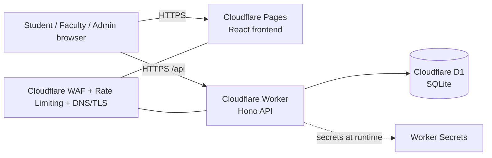

# Deployment Plan (all Cloudflare)

Talon runs entirely on Cloudflare: the API is a **Worker**, the database is **D1**, and the React
frontend is served from **Cloudflare Pages**. There is no VM, no container, and no open database
port anywhere in the system.



## Sharing the database with your team

A D1 database belongs to a Cloudflare **account**, not to a person or a project. Sharing it means
adding your teammates to that account.

1. You must be **Super Administrator** on the account and have a **verified email address**.
2. Cloudflare dashboard → **Manage Account → Members → Invite**.
3. Enter their email addresses, leave the scope as the whole account, and assign the
   **Cloudflare Workers Admin** role. That covers Workers and D1 without handing over billing or
   DNS. Use *Administrator* only if someone genuinely needs everything.
4. They accept the emailed invitation, run `npx wrangler login`, and immediately see the same
   database from `npx wrangler d1 list`.

Role-based access control is available on every Cloudflare plan, including Free, so this does not
require a paid upgrade.

**Never share the account password, and do not paste an API token into the repo.** For CI or
automated deploys, create a scoped API token with D1 edit permission instead.

### The thing you actually share is the migrations folder

Do not have four people developing against the one remote database. `wrangler dev` gives each
developer a **local** D1 instance, and local and remote data are separated by default. The shared
artifact is `server/migrations/`, committed to git:

```bash
git pull                                  # get the latest migrations
npm run db:migrate:local --workspace=server   # apply them to your own local D1
npm run db:seed:local --workspace=server      # load demo data locally
npm run dev --workspace=server                # work against your local copy
```

The remote database is for the deployed app and shared demos only. Changes made against remote D1
cannot be undone, so a careless `DELETE` there destroys everyone's data; the same mistake locally
costs one reseed.

When someone changes the schema, they edit `server/src/db/schema.ts`, run
`npm run db:generate --workspace=server` to produce a new migration file, and commit it. Everyone
else pulls and applies it. That keeps the schema in version control rather than in one person's
dashboard.

## First-time setup

```bash
# 1. Authenticate
npx wrangler login

# 2. Create the database (only one person does this, then shares the id)
npx wrangler d1 create talon-db

# 3. Put the returned database_id into server/wrangler.toml
#    (the id is NOT a secret - it is safe to commit and teammates need it)

# 4. Create the schema, remotely and locally
npm run db:migrate:remote --workspace=server
npm run db:migrate:local --workspace=server

# 5. Seed demo data
npm run db:seed:generate --workspace=server   # regenerates seed.sql with fresh password hashes
npm run db:seed:local --workspace=server
```

## Secrets

Never put these in `wrangler.toml` and never commit them.

```bash
# Deployed environments
npx wrangler secret put JWT_ACCESS_SECRET --cwd server
npx wrangler secret put JWT_REFRESH_SECRET --cwd server

# Generate values with:
openssl rand -base64 48
```

For local development, copy `server/.dev.vars.example` to `server/.dev.vars` (git-ignored).

## Deploying

```bash
npm run deploy:server    # publishes the Worker
npm run deploy:client    # builds and publishes the frontend to Pages
```

After the first deploy, set the frontend's `VITE_API_BASE_URL` to the Worker URL
(`https://talon-api.<your-subdomain>.workers.dev/api`) and update `CORS_ORIGIN` in
`server/wrangler.toml` to the Pages URL, then redeploy both. A custom domain can be attached to
either from the dashboard.

## The Workers Free plan cannot run a real password login

This is the one constraint that materially affects the project, and it is worth stating plainly in
your writeup because it is a measured result rather than an opinion.

| Plan | CPU per request | D1 queries per request | Requests/day |
|---|---|---|---|
| Free | **10 ms** | 50 | 100,000 |
| Paid ($5/mo) | 30 s (up to 5 min) | 1,000 | unmetered |

Password hashing is *deliberately* slow. Measured locally in `wrangler dev`, one login at the
OWASP-recommended 600,000 PBKDF2 iterations costs **roughly 2.4 seconds of CPU**, against a 0.23 s
baseline for a request that does no hashing. That is about **240x the Free plan's 10 ms budget**.
Lowering the iteration count does not rescue it: even a badly weakened 10,000 iterations would still
land in the tens of milliseconds. No secure password hash fits in 10 ms.

There are three honest options:

1. **Workers Paid ($5/month)** — keep the password login exactly as designed. Simplest, and cheap
   enough for a semester.
2. **Cloudflare Access (Zero Trust) in front of the app** — authentication happens at Cloudflare's
   edge against TN Tech SSO or a one-time email PIN, and the Worker only *verifies* the signed
   identity token Access injects, which costs about a millisecond. This stays on the free plan and
   is the better long-term architecture: it is also what the security plan recommends instead of
   storing local passwords for real employees.
3. **Local demo only** — `wrangler dev` has no CPU limit, so the full system runs and demos on the
   free plan as long as it is not publicly deployed.

The code supports all three. `PBKDF2_ITERATIONS` is configurable in `wrangler.toml`, and the stored
hash records the iteration count it was created with, so the cost can be raised later without
invalidating existing passwords.

## Security controls at the edge

Moving off a VM deletes an entire category of hardening work — there is no SSH port to move, no
firewall to configure, no OS to patch, and D1 has no network listener to expose. What replaces it:

- **WAF and Rate Limiting rules** in the Cloudflare dashboard, applied before a request ever reaches
  the Worker. Put a stricter rate limit on `/api/auth/*` than on the rest of the API.
- **TLS** is automatic and cannot be misconfigured to serve plaintext.
- **Cloudflare Access** can restrict the whole app to TN Tech accounts or to campus IP ranges, which
  is the correct layer for the "must be on the TN Tech network" requirement.
- **Secrets** are encrypted at rest by Cloudflare and are never present in the repository.

See [SECURITY.md](SECURITY.md) for the application-level controls.

## Costs

| Item | Free tier | Notes |
|---|---|---|
| Workers | 100k requests/day | 10 ms CPU limit is the blocker described above |
| D1 | 500 MB/database, 5 GB total, 10 databases | Far beyond what this project needs |
| Pages | Unlimited static requests | Frontend hosting is genuinely free |
| Workers Paid | $5/month | Needed only for a deployed password login |
