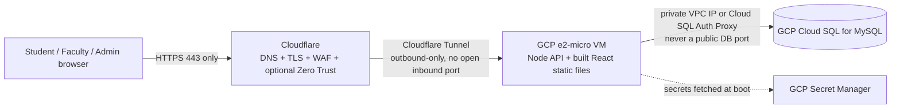

# Deployment Plan (GCP + Cloudflare)

This scaffold runs entirely on localhost today (Docker Compose MySQL + two `npm run dev` processes).
This doc is the plan for when you're ready to host it for real, matching the "GCP free credits,
Cloudflare domain, hardened ports" requirements from the project brief.

## Recommended architecture

## Why Cloud SQL (MySQL) over Firebase/self-managed

The brief lists "hashed hosted MySQL or Firebase or GCP" as options. Recommendation: **GCP Cloud SQL
for MySQL**, not Firebase/Firestore, because:
- The data is inherently relational (users → departments → colleges, time entries → pay stubs → pay
  periods, with real foreign-key integrity requirements like "a pay stub must reference a real user
  and a real pay period"). Firestore's document model fights this.
- Prisma's MySQL support is mature; the schema in [DATABASE.md](DATABASE.md) already assumes it.
- Cloud SQL gives you automated backups, point-in-time recovery, and the Cloud SQL Auth Proxy —
  meaning the database never needs a public IP or open port at all, which directly satisfies
  "block unused ports."
- "Hashed" in the brief presumably means *credentials* hashed (passwords are — bcrypt, see
  [SECURITY.md](SECURITY.md)), not the database itself; Cloud SQL supports encryption at rest by
  default regardless.

Self-hosting MySQL on the VM (rather than Cloud SQL) is possible and cheaper, but you take on patching,
backups, and port exposure yourself — reasonable for a class project budget, worth calling out as a
tradeoff in your presentation. The app code doesn't care either way; only `DATABASE_URL` changes.

## GCP free-tier setup

1. **Create a GCP project**, enable billing (new accounts get **$300 in free credits for 90 days**;
   separately, the **Always Free tier** includes one `e2-micro` VM instance per month indefinitely in
   specific US regions — `us-west1`, `us-central1`, `us-east1` — which is enough to host this app
   after the trial credit runs out).
2. **Compute Engine**: create an `e2-micro` VM in one of the Always Free regions, Debian or Ubuntu
   LTS image, **no public IP if using a Cloudflare Tunnel** (see below) — otherwise a static external
   IP.
3. **Cloud SQL**: create a MySQL 8 instance on the smallest tier (`db-f1-micro` is not covered by
   Always Free, so budget a few dollars/month or use the trial credit — for a class project, an
   alternative is self-hosting MySQL on the same VM via the existing `docker-compose.yml` to stay
   fully within Always Free). Enable the Cloud SQL Auth Proxy so the VM connects over a private,
   authenticated channel instead of a public DB port.
4. **Secret Manager**: store `JWT_ACCESS_SECRET`, `JWT_REFRESH_SECRET`, and the DB password here
   instead of a `.env` file on the VM; grant the VM's service account `roles/secretmanager.secretAccessor`
   and fetch them into environment variables at service start (a small systemd `ExecStartPre` script
   or a startup script calling `gcloud secrets versions access` works fine for a class project).

## Port & firewall hardening on the VM

1. Change SSH off port 22: edit `/etc/ssh/sshd_config`, set `Port <something not 22>`, restart `sshd`,
   then update the matching GCP firewall rule *before* disconnecting your current session (test the
   new port in a second terminal before closing the first).
2. **Default-deny inbound.** In GCP VPC firewall rules: remove the default `allow-ssh`/`allow-http`
   rules that apply to `0.0.0.0/0`, and add narrow rules instead:
   - SSH (your custom port) from your own IP or a VPN range only.
   - If not using a Cloudflare Tunnel: HTTPS (443) from Cloudflare's published IP ranges only —
     never open the app's Node port (`4317`) or the DB port to `0.0.0.0/0`.
3. **Prefer a Cloudflare Tunnel** (`cloudflared` running on the VM) over opening any inbound port for
   the app at all. The tunnel dials out to Cloudflare; nothing needs to be open on the VM's firewall
   for web traffic, which is the strongest version of "block unused ports."
4. On the VM's own firewall (`ufw`), mirror the same default-deny posture as a second layer:
   `ufw default deny incoming`, allow only the custom SSH port (and 443 if not tunneling).
5. Run the Node process as a dedicated non-root user via systemd, not as `root`.

## Cloudflare setup

1. Point your domain's nameservers at Cloudflare (or use a subdomain if TN Tech controls the apex
   domain — ask IT before touching any `tntech.edu` DNS).
2. Install `cloudflared` on the VM, run `cloudflared tunnel create talon`, add a DNS record pointing
   your chosen hostname at the tunnel, and point the tunnel's ingress rule at
   `http://localhost:4317` (the API) and the static frontend build.
3. SSL/TLS mode: **Full (strict)** — issue a Cloudflare Origin Certificate for the VM so the
   Cloudflare↔origin hop is encrypted too, not just the browser↔Cloudflare hop.
4. Turn on **Always Use HTTPS** and **Automatic HTTPS Rewrites**.
5. Optional but recommended for the "TN Tech subnet" requirement: **Cloudflare Access** (Zero Trust,
   free for small teams) in front of the hostname, requiring TN Tech SSO login or restricting to TN
   Tech's published IP ranges — see [SECURITY.md](SECURITY.md#network--host-hardening) for why this
   belongs at this layer instead of in the app.
6. Cloudflare's WAF/rate-limiting rules (free tier includes basic protections) act as an extra layer
   in front of the app's own rate limiter.

## Application deployment

1. `npm run build --workspace=server` (compiles TypeScript to `server/dist`).
2. `npm run build --workspace=client` (produces static assets in `client/dist`); serve these from
   Cloudflare Pages, or from the same Node process via `express.static`, or from Nginx in front of it
   — any of the three is fine for this scale.
3. `npx prisma migrate deploy --schema=server/prisma/schema.prisma` against the production
   `DATABASE_URL` (Cloud SQL Auth Proxy or private IP) — non-interactive, safe for CI/CD.
4. Run the API under a process manager (systemd unit or `pm2`) so it restarts on crash/reboot.
5. Set `NODE_ENV=production` — this tightens cookie `secure` flags and Helmet defaults already wired
   into the code (see `server/src/config/env.ts` and `middleware/security.ts`).

## Suggested project timeline

See [GANTT.md](GANTT.md) for a semester-scale gantt chart covering design → build → hosting →
hardening → testing, sized for a capstone deliverable schedule.
