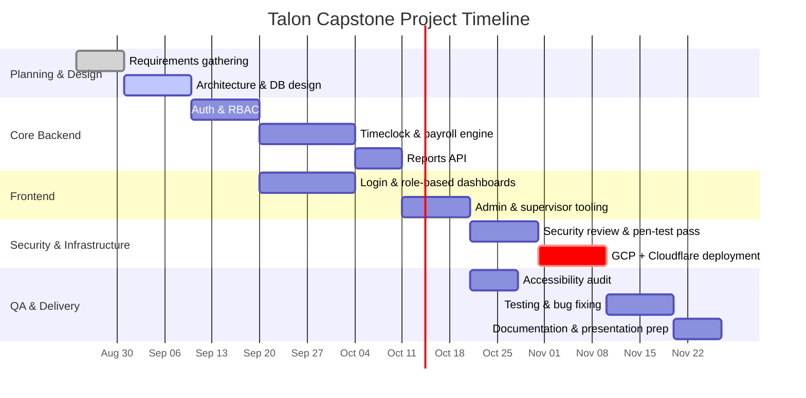

# Project Timeline

A suggested semester-scale schedule for the Talon capstone, sized around a ~15-week term. Adjust
dates to your actual syllabus; the sequencing/dependencies are the part worth keeping.

## Milestones tied to this repo

| Phase | Status | Artifact |
|---|---|---|
| Architecture & DB design | Done | [DATABASE.md](DATABASE.md), `server/prisma/schema.prisma` |
| Auth & RBAC | Done (local scaffold) | `server/src/routes/auth.routes.ts`, `middleware/auth.ts` |
| Timeclock & payroll engine | Done (local scaffold) | `server/src/services/payroll.service.ts` |
| Reports API | Done (local scaffold) | `server/src/routes/reports.routes.ts` |
| Frontend dashboards | Done (local scaffold) | `client/src/pages`, `client/src/components` |
| Security review | Ongoing | [SECURITY.md](SECURITY.md) |
| GCP + Cloudflare deployment | Not started | [DEPLOYMENT.md](DEPLOYMENT.md) |
| Accessibility audit | Baseline in place, needs a real screen-reader pass | [SECURITY.md#accessibility](SECURITY.md#accessibility-as-a-security-adjacent-requirement) |
| Testing & QA | Not started | add `server`/`client` test suites |
| Documentation & presentation | Ongoing | this `docs/` folder |
