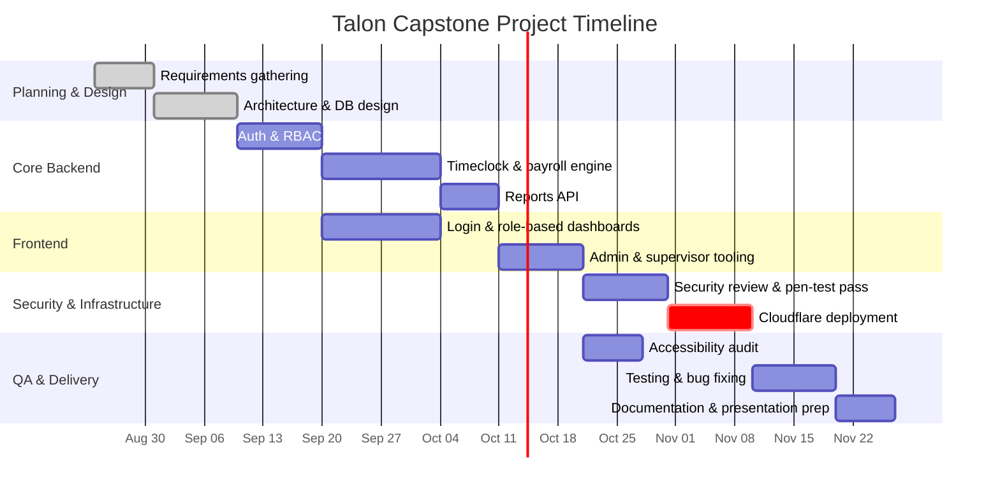

# Project Timeline

A suggested semester-scale schedule for the Talon capstone, sized around a ~15-week term. Adjust
dates to your actual syllabus; the sequencing/dependencies are the part worth keeping.

## Milestones tied to this repo

| Phase | Status | Artifact |
|---|---|---|
| Architecture & DB design | Done | [DATABASE.md](DATABASE.md), `server/src/db/schema.ts` |
| Auth & RBAC | Done, verified against D1 | `server/src/routes/auth.routes.ts`, `middleware/auth.ts` |
| Timeclock & payroll engine | Done, verified (incl. overtime) | `server/src/services/payroll.service.ts` |
| Reports API | Done, verified | `server/src/routes/reports.routes.ts` |
| Frontend dashboards | Done, verified against the Worker | `client/src/pages`, `client/src/components` |
| Migration to Cloudflare (Workers + D1) | Done | [ARCHITECTURE.md](ARCHITECTURE.md#migration-notes-from-the-node--mysql-design) |
| Security review | Ongoing | [SECURITY.md](SECURITY.md) |
| Cloudflare deployment (Worker assets/API + D1) | Deployed | [DEPLOYMENT.md](DEPLOYMENT.md) |
| SSO via Cloudflare Access | Optional; local passwords selected | [SECURITY.md](SECURITY.md#known-gaps) |
| Accessibility audit | Baseline in place, needs a real screen-reader pass | `client/src/components` |
| Responsive (tablet/mobile) work | Baseline complete; real-device review remains | `client/src/styles.css` |
| Testing & QA | Manual verification complete; automated suites remain | add `server`/`client` test suites |
| Documentation & presentation | Ongoing | this `docs/` folder |
